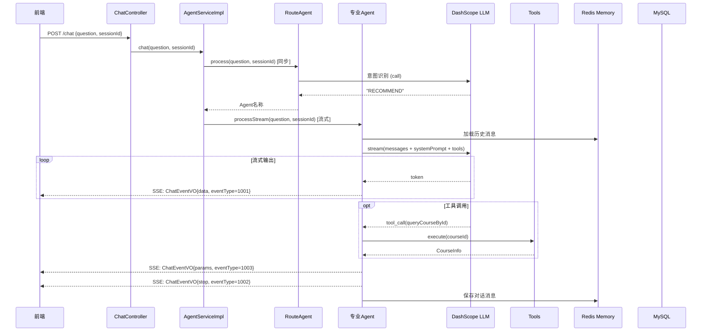
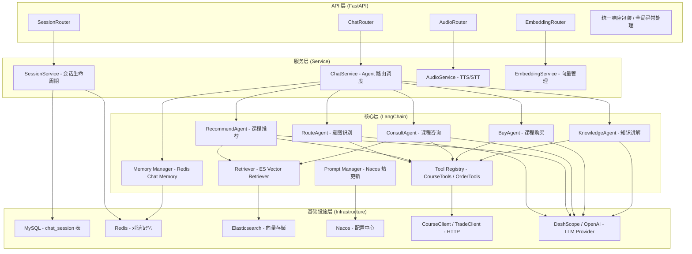
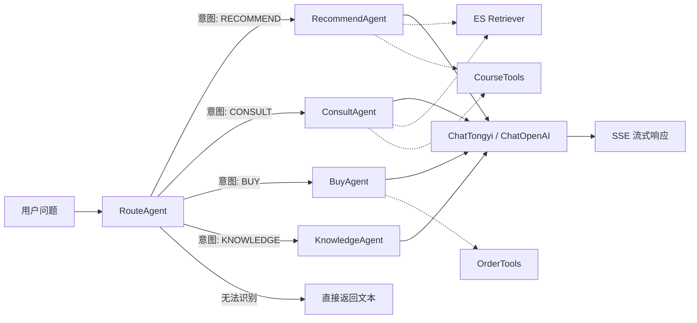

# tj-aigc 模块迁移实施方案：Spring AI -> LangChain + FastAPI

> 基于对 tj-aigc (Java) 模块的完整源码分析，制定向 LangChain 0.2+ / FastAPI 0.110+ 的迁移方案。
> 目标：功能 100% 兼容，API 接口零变更，可灰度切换。

---

## 一、原模块深度分析

### 1.1 功能全景

| 功能域 | 子功能 | 涉及组件 |
|--------|--------|----------|
| **AI 对话** | 多 Agent 路由对话（SSE 流式） | AgentServiceImpl, RouteAgent, RecommendAgent, ConsultAgent, BuyAgent, KnowledgeAgent |
| | 纯文本同步对话 | AgentServiceImpl.chatText() |
| | 停止生成 | ConcurrentHashMap + takeWhile |
| **会话管理** | 创建/删除/查询历史会话 | ChatSessionService, MySQL |
| | 查询/更新会话标题 | ChatSessionService |
| | 查询对话消息历史 | Redis ChatMemory |
| **RAG 知识库** | 向量存储/删除/搜索 | VectorStore (Elasticsearch) |
| | 检索增强生成 | QuestionAnswerAdvisor |
| **工具调用** | 课程查询 | CourseTools -> CourseClient (Feign) |
| | 预下单 | OrderTools -> TradeClient (Feign) |
| **语音** | TTS 文字转语音（流式） | OpenAiAudioSpeechModel |
| | STT 语音转文字 | OpenAiAudioTranscriptionModel |
| **写作助手** | 联想词/帮写/续写/润色/精简 | TemplateVO (静态模板) |
| **配置管理** | 系统提示词热更新 | Nacos ConfigManager |

### 1.2 对外 API 接口清单（13 个）

| # | 方法 | 路径 | 请求参数 | 返回类型 | 说明 |
|---|------|------|----------|----------|------|
| 1 | GET | `/chat/templates` | 无 | `R<TemplateVO>` | 获取写作提示词模板 |
| 2 | POST | `/chat` | `ChatDTO{question, sessionId}` | `Flux<ChatEventVO>` (SSE) | **核心对话接口**，多 Agent 路由 + 流式输出 |
| 3 | POST | `/chat/stop` | `sessionId` | `R<Void>` | 停止 AI 回复 |
| 4 | POST | `/chat/text` | `String question` | `R<String>` | 纯文本同步对话 |
| 5 | POST | `/session` | `n: int` | `R<SessionVO>` | 创建会话 |
| 6 | GET | `/session/hot` | `n: int` | `R<List<Example>>` | 获取热门问题 |
| 7 | GET | `/session/{sessionId}` | path: sessionId | `R<List<MessageVO>>` | 查询会话消息历史 |
| 8 | GET | `/session/history` | 无 | `R<Map<String, List<ChatSessionVO>>>` | 查询历史会话（按时间分组） |
| 9 | DELETE | `/session/history` | `sessionId` | `R<Void>` | 删除会话 |
| 10 | PUT | `/session/history` | `sessionId, title` | `R<Void>` | 更新会话标题 |
| 11 | POST | `/audio/tts-stream` | `String text` | `audio/mp3` (流式) | 文字转语音 |
| 12 | POST | `/audio/stt` | `MultipartFile audioFile` | `R<String>` | 语音转文字 |
| 13 | POST | `/embedding` | `List<String> messages` | `R<Void>` | 保存向量 |
| 14 | GET | `/embedding` | `message` | `R<EmbeddingResponse>` | 获取向量 |
| 15 | DELETE | `/embedding` | `List<String> ids` | `R<Void>` | 删除向量 |
| 16 | GET | `/embedding/search` | `message` | `R<List<Document>>` | 向量相似搜索 |
| 17 | GET | `/embedding/search/all` | 无 | `R<List<Document>>` | 查询全部向量 |

### 1.3 核心业务流程



### 1.4 原架构痛点（迁移价值）

| 痛点 | 说明 | LangChain 解决方案 |
|------|------|-------------------|
| Spring AI Agent 抽象薄弱 | AbstractAgent 300+ 行，混杂流控/记忆/工具/状态管理 | LangChain AgentExecutor 统一管理，职责分离 |
| 工具结果跨层传递 | ToolResultHolder 用 ConcurrentHashMap 在工具/流/持久化层间传数据 | LangChain Tool 的 return_direct 机制 + callback |
| 记录优化用 Advisor hack | RecordOptimizationAdvisor 在回调中删除 Redis 记录 | LangChain Memory 的 clear() 或自定义 Memory 管理 |
| 双 LLM 客户端维护成本 | dashScope + openai 两套配置和 Bean | LangChain 统一 ChatModel 接口，按需切换 provider |
| 无结构化链路追踪 | 靠 requestId 手动串联 | LangChain Callbacks / LangSmith 原生支持 |

### 1.5 风险评估

| 风险 | 等级 | 影响 | 应对 |
|------|------|------|------|
| SSE 事件格式不兼容 | **高** | 前端需改动 | 严格保持 ChatEventVO 的 eventType 编码（1001/1002/1003） |
| Redis 消息格式不兼容 | **高** | 历史消息丢失 | 实现兼容的序列化/反序列化，或提供迁移脚本 |
| DashScope 模型行为差异 | **中** | Agent 路由准确率下降 | 使用相同模型版本，保留 system prompt 不变 |
| 工具调用参数传递 | **中** | 前端无法展示工具结果 | 保留 ToolResultHolder 模式或用 callback 替代 |
| Feign 调用需改 HTTP Client | **低** | 服务间调用 | 用 httpx 替代，接口不变 |

---

## 二、新架构设计

### 2.1 分层架构



### 2.2 项目目录结构

```
tj-aigc-py/
├── app/
│   ├── __init__.py
│   ├── main.py                     # FastAPI 应用入口
│   ├── core/
│   │   ├── config.py               # pydantic-settings 配置
│   │   ├── database.py             # SQLAlchemy 引擎
│   │   ├── redis.py                # Redis 客户端
│   │   ├── nacos_client.py         # Nacos 配置客户端
│   │   ├── deps.py                 # FastAPI 依赖注入
│   │   └── prompts.py              # Prompt 模板管理（Nacos 热更新）
│   ├── api/
│   │   ├── __init__.py
│   │   ├── deps.py                 # API 层依赖（UserContext 等）
│   │   ├── middleware.py           # 响应包装 / 鉴权中间件
│   │   └── v1/
│   │       ├── chat.py             # /chat 路由
│   │       ├── session.py          # /session 路由
│   │       ├── audio.py            # /audio 路由
│   │       └── embedding.py        # /embedding 路由
│   ├── models/
│   │   ├── chat_session.py         # SQLModel 持久化模型
│   │   └── schemas/
│   │       ├── chat.py             # ChatDTO / ChatEventVO / MessageVO
│   │       ├── session.py          # SessionVO / ChatSessionVO
│   │       ├── audio.py            # AudioRequest
│   │       └── embedding.py        # EmbeddingRequest/Response
│   ├── agents/
│   │   ├── __init__.py
│   │   ├── base.py                 # BaseAgent 抽象基类
│   │   ├── router_agent.py         # RouteAgent
│   │   ├── recommend_agent.py      # RecommendAgent
│   │   ├── consult_agent.py        # ConsultAgent
│   │   ├── buy_agent.py            # BuyAgent
│   │   └── knowledge_agent.py      # KnowledgeAgent
│   ├── chains/
│   │   ├── __init__.py
│   │   ├── chat_chain.py           # 对话 Chain（组装 Memory + Tools + Prompt）
│   │   └── route_chain.py          # 路由 Chain（意图识别）
│   ├── memory/
│   │   ├── __init__.py
│   │   └── redis_memory.py         # LangChain RedisChatMessageHistory 封装
│   ├── tools/
│   │   ├── __init__.py
│   │   ├── course_tools.py         # 课程查询工具
│   │   ├── order_tools.py          # 预下单工具
│   │   └── result_holder.py        # 工具结果缓存（兼容原逻辑）
│   ├── services/
│   │   ├── __init__.py
│   │   ├── chat_service.py         # 对话调度服务
│   │   ├── session_service.py      # 会话管理服务
│   │   ├── audio_service.py        # 语音服务
│   │   └── embedding_service.py    # 向量服务
│   ├── clients/
│   │   ├── __init__.py
│   │   ├── course_client.py        # 课程服务 HTTP 客户端
│   │   ├── trade_client.py         # 交易服务 HTTP 客户端
│   │   ├── dashscope_client.py     # DashScope LLM
│   │   └── openai_client.py        # OpenAI LLM / Audio
│   ├── enums.py                    # AgentType / ChatEventType / MessageType
│   ├── exceptions.py               # 自定义异常
│   └── utils/
│       ├── __init__.py
│       ├── snowflake.py            # 雪花 ID 生成器
│       ├── message_util.py         # 消息序列化工具
│       └── text_converter.py       # 繁简转换
├── prompts/                        # 默认提示词文件（兜底用）
│   ├── route_agent.txt
│   ├── recommend_agent.txt
│   ├── consult_agent.txt
│   ├── buy_agent.txt
│   └── knowledge_agent.txt
├── tests/
│   ├── conftest.py
│   ├── test_api/
│   ├── test_agents/
│   └── test_services/
├── alembic/                        # 数据库迁移
├── docker/
│   ├── Dockerfile
│   └── docker-compose.yml
├── .env.example
├── pyproject.toml
└── README.md
```

### 2.3 LangChain 组件映射

| 原 Spring AI 组件 | LangChain 对应组件 | 说明 |
|-------------------|-------------------|------|
| `ChatClient.call()` / `.stream()` | `ChatModel.invoke()` / `.stream()` | 统一接口，DashScope 用 `ChatTongyi`，OpenAI 用 `ChatOpenAI` |
| `ChatClient.prompt().system().user().call()` | `ChatPromptTemplate.from_messages()` + `chain.invoke()` | Prompt 模板化 |
| `ChatMemory` (Redis) | `RedisChatMessageHistory` + `ConversationBufferWindowMemory` | LangChain 原生 Redis 支持 |
| `MessageChatMemoryAdvisor` | `ConversationChain` 或自定义 Chain 自动注入 | Memory 自动管理 |
| `@Tool` + `ToolContext` | `@tool` decorator + `InjectedToolArg` | LangChain 工具定义 |
| `QuestionAnswerAdvisor` (VectorStore) | `VectorStoreRetriever` + `RetrievalQA` 或 `create_retrieval_chain` | RAG 链 |
| `AbstractAgent.processStream()` | `AgentExecutor.stream()` 或 `astream_events()` | Agent 流式执行 |
| `RecordOptimizationAdvisor` | 自定义 `BaseCallbackHandler` 在 `on_llm_end` 中清理 | 回调机制 |
| `ToolResultHolder` | `RunnablePassthrough` 或自定义 callback 传递 | 结果透传 |
| `ResponseBodyEmitter` (TTS) | `StreamingResponse` | FastAPI 原生流式响应 |
| `@Async` 异步更新 | `asyncio.create_task()` 或 `BackgroundTasks` | Python 原生异步 |

### 2.4 多 Agent 路由架构（LangChain 实现）



**RouteAgent 实现策略**：使用 `ChatModel.invoke()` 同步调用，解析返回的 Agent 名称字符串，再调度到对应的 Agent。与原 Java 逻辑完全一致。

**专业 Agent 实现策略**：每个 Agent 封装为一个 LangChain `RunnableSequence`，包含：
- `SystemPromptTemplate`（从 Nacos 加载）
- `ChatPromptTemplate`（系统提示 + 历史 + 用户输入）
- `ChatModel.bind_tools()`（绑定工具）
- `StrOutputParser()` 或自定义 output parser

流式执行使用 `chain.astream()` 或 `AgentExecutor.astream_events()`。

### 2.5 FastAPI 设计要点

#### 依赖注入

```python
# app/core/deps.py
from functools import lru_cache
from app.core.config import Settings

@lru_cache
def get_settings() -> Settings:
    return Settings()

async def get_db() -> AsyncGenerator[AsyncSession, None]:
    async with async_session() as session:
        yield session

async def get_current_user_id(request: Request) -> int:
    """从网关透传的 header 中提取用户 ID"""
    return int(request.headers.get("X-User-Id", 0))
```

#### SSE 流式响应

```python
# app/api/v1/chat.py
from fastapi.responses import StreamingResponse
import json

@router.post("/chat")
async def chat(dto: ChatDTO, user_id: int = Depends(get_current_user_id)):
    async def event_generator():
        async for event in chat_service.chat(dto.question, dto.sessionId, user_id):
            yield f"data: {json.dumps(event, ensure_ascii=False)}\n\n"

    return StreamingResponse(
        event_generator(),
        media_type="text/event-stream",
        headers={"Cache-Control": "no-cache", "X-Accel-Buffering": "no"}
    )
```

#### 统一响应包装

```python
# app/api/middleware.py
from starlette.middleware.base import BaseHTTPMiddleware

class ResponseWrapperMiddleware(BaseHTTPMiddleware):
    SKIP_PATHS = {"/chat", "/audio/tts-stream"}  # 流式接口跳过包装

    async def dispatch(self, request, call_next):
        response = await call_next(request)
        if request.url.path in self.SKIP_PATHS:
            return response
        # 包装为 R<T> 格式
        ...
```

#### 全局异常处理

```python
# app/main.py
from fastapi import FastAPI
from app.exceptions import BizException

@app.exception_handler(BizException)
async def biz_exception_handler(request, exc):
    return JSONResponse(
        status_code=200,
        content={"code": exc.code, "msg": exc.message, "data": None}
    )
```

---

## 三、分阶段实施计划

### 阶段 1：准备工作（1-2 天）

**目标**：搭建项目骨架，确保开发环境就绪

| 任务 | 交付物 | 预计时间 |
|------|--------|----------|
| 创建 pyproject.toml，声明所有依赖 | `pyproject.toml` | 0.5 天 |
| 初始化 FastAPI 应用入口 + 配置管理 | `main.py`, `config.py` | 0.5 天 |
| 搭建目录结构（按 2.2 节） | 完整目录骨架 | 0.2 天 |
| 配置 Docker / docker-compose | `Dockerfile`, `docker-compose.yml` | 0.3 天 |
| 编写原模块 API 的兼容性测试用例（请求/响应格式断言） | `tests/test_compat/` | 0.5 天 |

**核心依赖** (pyproject.toml)：

```toml
[project]
name = "tj-aigc-py"
version = "1.0.0"
requires-python = ">=3.11"
dependencies = [
    "fastapi>=0.110.0",
    "uvicorn[standard]>=0.27.0",
    "langchain>=0.2.0",
    "langchain-community>=0.2.0",
    "langchain-openai>=0.1.0",
    "langchain-dashscope>=0.1.0",      # DashScope ChatModel
    "langchain-redis>=0.1.0",          # Redis Memory
    "langchain-elasticsearch>=0.2.0",  # ES VectorStore
    "sqlmodel>=0.0.16",
    "sqlalchemy[asyncio]>=2.0.0",
    "aiomysql>=0.2.0",
    "redis[hiredis]>=5.0.0",
    "httpx>=0.27.0",                   # 替代 Feign
    "pydantic-settings>=2.0.0",
    "python-multipart>=0.0.6",
    "opencc-python-reimplemented>=0.1.7",  # 繁简转换
    "nacos-sdk-python>=0.1.12",        # Nacos 客户端
    "alembic>=1.13.0",
]
```

### 阶段 2：核心基础设施迁移（2-3 天）

**目标**：基础设施层全部就绪，可通过测试验证

| 任务 | 交付物 | 预计时间 |
|------|--------|----------|
| 配置管理（pydantic-settings + Nacos 热更新） | `config.py`, `nacos_client.py` | 0.5 天 |
| MySQL 连接 + ChatSession SQLModel | `database.py`, `models/chat_session.py` | 0.5 天 |
| Redis 客户端初始化 | `redis.py` | 0.2 天 |
| LangChain Redis Chat Memory 封装 | `memory/redis_memory.py` | 0.5 天 |
| LLM Provider 初始化（ChatTongyi + ChatOpenAI） | `clients/dashscope_client.py`, `clients/openai_client.py` | 0.5 天 |
| Prompt 管理器（Nacos 加载 + 热更新 + 兜底文件） | `core/prompts.py` | 0.5 天 |
| ES VectorStore + Retriever 初始化 | `clients/elasticsearch_client.py` | 0.3 天 |
| HTTP 客户端（httpx 封装 CourseClient / TradeClient） | `clients/course_client.py`, `clients/trade_client.py` | 0.5 天 |
| 雪花 ID 生成器（已有，验证兼容性） | `utils/snowflake.py` | 0.1 天 |
| 单元测试：基础设施层 | `tests/test_infra/` | 0.5 天 |

**Redis Memory 兼容性关键设计**：

```python
# app/memory/redis_memory.py
from langchain_community.chat_message_histories import RedisChatMessageHistory
from langchain_core.messages import AIMessage, HumanMessage, SystemMessage

class CompatibleRedisMemory:
    """兼容原 Java 版 Redis 消息格式的 Memory 管理器"""

    def __init__(self, redis_url: str, conversation_id: str, k: int = 1000):
        self.history = RedisChatMessageHistory(
            session_id=conversation_id,
            url=redis_url,
            key_prefix="chat:",  # 与原 Java 版一致: chat:{conversationId}
        )
        self.k = k

    async def get_messages(self) -> list:
        """获取历史消息，兼容原格式"""
        messages = self.history.messages[-self.k:]
        return [m for m in messages if isinstance(m, (HumanMessage, AIMessage))]

    async def add_user_message(self, content: str):
        self.history.add_user_message(content)

    async def add_ai_message(self, content: str, params: dict | None = None):
        """保存 AI 消息，可携带工具调用参数（兼容 MyAssistantMessage.params）"""
        msg = AIMessage(content=content)
        if params:
            msg.additional_kwargs["params"] = params
        self.history.add_message(msg)

    async def clear(self):
        self.history.clear()

    async def optimize_route_records(self):
        """删除路由 Agent 产生的中间记录（兼容 RecordOptimizationAdvisor）"""
        messages = self.history.messages
        if len(messages) >= 2:
            # 删除最后 2 条（路由的 user + assistant）
            self.history.messages = messages[:-2]
            self.history._redis_client.ltrim(
                self.history.key, 0, len(messages) - 3
            )
```

### 阶段 3：核心业务逻辑迁移（3-5 天）

**目标**：所有 Agent + 工具 + 对话链路可运行

| 任务 | 交付物 | 预计时间 |
|------|--------|----------|
| BaseAgent 抽象基类 | `agents/base.py` | 0.5 天 |
| RouteAgent（意图识别 Chain） | `agents/router_agent.py` | 0.5 天 |
| RecommendAgent（RAG + CourseTools） | `agents/recommend_agent.py` | 0.5 天 |
| ConsultAgent（RAG + CourseTools + 时间参数） | `agents/consult_agent.py` | 0.5 天 |
| BuyAgent（OrderTools） | `agents/buy_agent.py` | 0.3 天 |
| KnowledgeAgent（纯对话） | `agents/knowledge_agent.py` | 0.2 天 |
| ToolResultHolder（工具结果缓存） | `tools/result_holder.py` | 0.3 天 |
| CourseTools（LangChain @tool） | `tools/course_tools.py` | 0.3 天 |
| OrderTools（LangChain @tool） | `tools/order_tools.py` | 0.3 天 |
| ChatService（Agent 路由调度 + SSE 流式生成） | `services/chat_service.py` | 1 天 |
| 消息序列化工具（兼容原 Redis 格式） | `utils/message_util.py` | 0.5 天 |
| 集成测试：对话全流程 | `tests/test_agents/` | 0.5 天 |

**BaseAgent 核心实现**：

```python
# app/agents/base.py
from abc import ABC, abstractmethod
from langchain_core.language_models import BaseChatModel
from langchain_core.prompts import ChatPromptTemplate, MessagesPlaceholder
from langchain_core.tools import BaseTool
from langchain_core.messages import AIMessageChunk
from typing import AsyncIterator

class BaseAgent(ABC):
    def __init__(self, llm: BaseChatModel, memory, prompt_manager):
        self.llm = llm
        self.memory = memory
        self.prompt_manager = prompt_manager

    @abstractmethod
    def agent_type(self) -> str: ...

    @abstractmethod
    def system_prompt(self) -> str: ...

    def tools(self) -> list[BaseTool]:
        return []

    def build_chain(self):
        """构建 LangChain 处理链"""
        prompt = ChatPromptTemplate.from_messages([
            ("system", self.system_prompt()),
            MessagesPlaceholder(variable_name="history"),
            ("human", "{input}"),
        ])
        llm = self.llm
        if self.tools():
            llm = llm.bind_tools(self.tools())
        return prompt | llm

    async def process_stream(self, question: str, session_id: str, user_id: int) -> AsyncIterator[dict]:
        """流式处理，产出 SSE 事件"""
        conversation_id = f"{user_id}_{session_id}"
        history = await self.memory.get_messages(conversation_id)

        chain = self.build_chain()
        full_response = ""
        tool_results = {}

        async for chunk in chain.astream({"input": question, "history": history}):
            if isinstance(chunk, AIMessageChunk) and chunk.content:
                full_response += chunk.content
                yield {"eventData": chunk.content, "eventType": 1001}

            # 处理工具调用
            if isinstance(chunk, AIMessageChunk) and chunk.tool_calls:
                for tc in chunk.tool_calls:
                    result = await self._execute_tool(tc, user_id, session_id)
                    tool_results.update(result)

        # 保存到记忆
        await self.memory.add_user_message(conversation_id, question)
        await self.memory.add_ai_message(conversation_id, full_response, tool_results)

        # 发送工具参数事件和停止事件
        if tool_results:
            yield {"eventData": tool_results, "eventType": 1003}
        yield {"eventData": None, "eventType": 1002}
```

**ChatService 路由调度**：

```python
# app/services/chat_service.py
class ChatService:
    AGENT_MAP: dict[str, BaseAgent]

    async def chat(self, question: str, session_id: str, user_id: int) -> AsyncIterator[dict]:
        # 1. 路由识别（同步）
        route_result = await self.route_agent.route(question, session_id, user_id)

        # 2. 清理路由中间记录
        conversation_id = f"{user_id}_{session_id}"
        await self.memory.optimize_route_records(conversation_id)

        # 3. 分发到专业 Agent
        agent = self.AGENT_MAP.get(route_result)
        if agent is None:
            # 无法识别，直接返回路由结果文本
            yield {"eventData": route_result, "eventType": 1001}
            yield {"eventData": None, "eventType": 1002}
            return

        # 4. 流式处理
        async for event in agent.process_stream(question, session_id, user_id):
            yield event
```

### 阶段 4：API 层迁移（2-3 天）

**目标**：所有 13+ 个 API 接口就绪，请求/响应格式与原接口 100% 兼容

| 任务 | 交付物 | 预计时间 |
|------|--------|----------|
| FastAPI 应用初始化 + 中间件 | `main.py`, `api/middleware.py` | 0.5 天 |
| Chat 路由（4 个接口） | `api/v1/chat.py` | 0.5 天 |
| Session 路由（6 个接口） | `api/v1/session.py` | 0.5 天 |
| Audio 路由（2 个接口） | `api/v1/audio.py` | 0.5 天 |
| Embedding 路由（5 个接口） | `api/v1/embedding.py` | 0.3 天 |
| SessionService（会话 CRUD） | `services/session_service.py` | 0.5 天 |
| AudioService（TTS 流式 / STT） | `services/audio_service.py` | 0.5 天 |
| EmbeddingService（向量 CRUD） | `services/embedding_service.py` | 0.3 天 |
| API 文档验证（Swagger） | 访问 `/docs` 确认 | 0.2 天 |
| 端到端测试（前端联调） | 手动测试报告 | 0.5 天 |

**SSE 事件格式兼容关键**：

```python
# 原 Java 版格式
# {"eventData": "你好", "eventType": 1001}   -- 数据事件
# {"eventData": null, "eventType": 1002}     -- 停止事件
# {"eventData": {...}, "eventType": 1003}    -- 参数事件

# Python 版必须完全一致
import json

async def event_generator(agent_stream):
    async for event in agent_stream:
        yield f"data: {json.dumps(event, ensure_ascii=False)}\n\n"
```

### 阶段 5：测试与优化（2-3 天）

**目标**：测试覆盖率 >= 80%，性能达标

| 任务 | 交付物 | 预计时间 |
|------|--------|----------|
| 单元测试（agents / services / tools） | `tests/` 覆盖率报告 | 1 天 |
| 集成测试（完整对话链路 + Redis/MySQL/ES） | `tests/integration/` | 0.5 天 |
| API 兼容性测试（与原 Java 接口响应对比） | `tests/test_compat/` | 0.5 天 |
| 性能测试（并发 SSE / 内存泄漏 / Redis 连接池） | 性能报告 | 0.5 天 |
| 代码审查 + 重构 | Code Review 报告 | 0.5 天 |

**测试策略**：

```python
# tests/conftest.py
import pytest
from httpx import AsyncClient, ASGITransport
from app.main import app

@pytest.fixture
async def client():
    transport = ASGITransport(app=app)
    async with AsyncClient(transport=transport, base_url="http://test") as c:
        yield c

# tests/test_compat/test_chat_api.py
async def test_chat_sse_event_format(client):
    """验证 SSE 事件格式与原 Java 版完全一致"""
    async with client.stream("POST", "/chat", json={"question": "推荐课程", "sessionId": "test-123"}) as resp:
        events = []
        async for line in resp.aiter_lines():
            if line.startswith("data: "):
                event = json.loads(line[6:])
                events.append(event)
                assert "eventType" in event
                assert event["eventType"] in (1001, 1002, 1003)

    # 最后一个事件必须是停止事件
    assert events[-1]["eventType"] == 1002
```

### 阶段 6：部署与上线（1-2 天）

**目标**：灰度上线，可随时回滚

| 任务 | 交付物 | 预计时间 |
|------|--------|----------|
| Docker 镜像构建 + 推送 | CI/CD 流水线 | 0.3 天 |
| 网关路由配置（灰度规则） | Nacos 路由配置 | 0.2 天 |
| 监控告警配置（日志 / 慢查询 / 错误率） | Grafana Dashboard | 0.3 天 |
| 灰度发布（5% -> 20% -> 50% -> 100%） | 发布记录 | 1 天 |
| 原 Java 版下线 | 下线确认 | 0.2 天 |

**Dockerfile**：

```dockerfile
FROM python:3.11-slim
WORKDIR /app
COPY pyproject.toml .
RUN pip install --no-cache-dir .
COPY . .
EXPOSE 8094
CMD ["uvicorn", "app.main:app", "--host", "0.0.0.0", "--port", "8094", "--workers", "4"]
```

---

## 四、代码迁移映射表

### 4.1 核心类/函数映射

| 原 Java 代码 | Python (LangChain) 对应 | 说明 |
|-------------|------------------------|------|
| `AgentServiceImpl.chat()` | `ChatService.chat()` | 入口不变，内部改用 LangChain 调度 |
| `AbstractAgent.processStream()` | `BaseAgent.process_stream()` | 用 `chain.astream()` 替代 Spring AI stream |
| `AbstractAgent.process()` | `BaseAgent.process()` | 用 `chain.ainvoke()` 替代 |
| `RouteAgent.process()` | `RouteAgent.route()` | 返回 Agent 名称字符串 |
| `RedisChatMemory` | `CompatibleRedisMemory` | 包装 LangChain RedisChatMessageHistory |
| `MessageChatMemoryAdvisor` | Memory 自动注入到 chain | 通过 MessagesPlaceholder |
| `RecordOptimizationAdvisor` | `RouteRecordCallback` | BaseCallbackHandler 子类 |
| `CourseTools.queryCourseById()` | `@tool def query_course_by_id()` | LangChain tool 装饰器 |
| `OrderTools.prePlaceOrder()` | `@tool def pre_place_order()` | LangChain tool 装饰器 |
| `ToolResultHolder` | `ToolResultHolder` | 保持不变，独立模块 |
| `QuestionAnswerAdvisor` | `VectorStoreRetriever` + chain | `retriever | context | llm` 链式 |
| `SpringAIConfig` | `app/core/deps.py` | FastAPI 依赖注入替代 Spring Bean |
| `SystemPromptConfig` | `PromptManager` | Nacos 加载逻辑不变 |
| `ChatSessionServiceImpl` | `SessionService` | SQLModel CRUD 替代 MyBatis-Plus |
| `OpenAIAudioServiceImpl` | `AudioService` | httpx 调 OpenAI API |
| `EmbeddingController` | `EmbeddingService` | LangChain Embeddings 接口 |

### 4.2 常见代码模式转换

**1. 流式对话（Spring AI -> LangChain）**

```java
// 原 Java
Flux<ChatEventVO> stream = chatClient.prompt()
    .system(systemMessage)
    .user(question)
    .advisors(memoryAdvisor)
    .tools(courseTools)
    .stream()
    .chatResponse()
    .map(response -> new ChatEventVO(response.getResult().getOutput().getContent(), 1001));
```

```python
# 新 Python
async for chunk in chain.astream({"input": question, "history": history}):
    if isinstance(chunk, AIMessageChunk) and chunk.content:
        yield ChatEventVO(event_data=chunk.content, event_type=1001)
```

**2. 工具定义（Spring AI -> LangChain）**

```java
// 原 Java
@Tool(description = "根据课程id查询课程详细信息")
public CourseInfo queryCourseById(Long courseId, ToolContext toolContext) { ... }
```

```python
# 新 Python
from langchain_core.tools import tool
from langchain_core.tools import InjectedToolArg

@tool
async def query_course_by_id(
    course_id: int,
    user_id: Annotated[int, InjectedToolArg],
    request_id: Annotated[str, InjectedToolArg],
) -> dict:
    """根据课程id查询课程详细信息"""
    ...
```

**3. SSE 响应（Spring WebFlux -> FastAPI）**

```java
// 原 Java
@PostMapping
@NoWrapper
public Flux<ChatEventVO> chat(@RequestBody ChatDTO dto) {
    return chatService.chat(dto.getQuestion(), dto.getSessionId());
}
```

```python
# 新 Python
@router.post("/chat")
async def chat(dto: ChatDTO, user_id: int = Depends(get_current_user_id)):
    async def event_generator():
        async for event in chat_service.chat(dto.question, dto.sessionId, user_id):
            yield f"data: {json.dumps(event, ensure_ascii=False)}\n\n"
    return StreamingResponse(event_generator(), media_type="text/event-stream")
```

**4. 对话记忆注入（Spring AI Advisor -> LangChain Memory）**

```java
// 原 Java
MessageChatMemoryAdvisor.builder()
    .chatMemory(chatMemory)
    .conversationId(userId + "_" + sessionId)
    .build();
```

```python
# 新 Python
from langchain_core.messages import MessagesPlaceholder

prompt = ChatPromptTemplate.from_messages([
    ("system", system_prompt),
    MessagesPlaceholder(variable_name="history"),  # 自动注入历史消息
    ("human", "{input}"),
])
```

---

## 五、风险应对表

| 风险 | 等级 | 触发条件 | 应对措施 |
|------|------|----------|----------|
| SSE 事件格式不兼容 | **高** | 前端解析 event data 失败 | 编写兼容性测试用例，逐字段校验 |
| Redis 历史消息丢失 | **高** | 新旧版 Redis key 格式不一致 | key 格式保持 `chat:{conversationId}`，消息序列化兼容 |
| DashScope Agent 路由准确率下降 | **中** | 系统提示词相同但模型行为变化 | 使用相同模型版本（qwen-plus），保留原始 system prompt |
| LangChain 工具调用参数丢失 | **中** | ToolResultHolder 数据无法传递到前端 | 保留 ToolResultHolder + callback 机制 |
| Nacos 配置热更新延迟 | **低** | 提示词更新不及时 | 设置合理轮询间隔 + 手动刷新 API |
| 大量并发 SSE 连接内存溢出 | **中** | 高并发场景 | 限制单实例 SSE 连接数 + 水平扩展 |
| Feign 重试上下文丢失 | **低** | httpx 重试时 UserContext 丢失 | 在 middleware 中传递 user_id 到 request.state |

---

## 六、验收标准

### 功能验收

| 编号 | 验收项 | 标准 |
|------|--------|------|
| F1 | API 接口兼容 | 13+ 个接口请求/响应格式与原 Java 版 100% 一致 |
| F2 | SSE 流式对话 | 前端无需修改即可正常接收流式事件 |
| F3 | 多 Agent 路由 | RouteAgent 正确分发到 4 个专业 Agent |
| F4 | 工具调用 | CourseTools / OrderTools 正确执行，结果通过 PARAM 事件传递 |
| F5 | RAG 检索 | ES 向量检索结果正确注入到 prompt |
| F6 | 对话记忆 | 多轮对话上下文正确加载和保存 |
| F7 | 会话管理 | 创建/删除/查询/更新历史会话正常 |
| F8 | TTS/STT | 语音合成和识别功能正常 |
| F9 | 提示词热更新 | Nacos 配置变更后自动生效 |

### 性能验收

| 编号 | 验收项 | 标准 |
|------|--------|------|
| P1 | 首 token 延迟 | < 1s（与原版持平） |
| P2 | 并发 SSE | 单实例支持 >= 100 并发对话 |
| P3 | 内存占用 | 稳态 < 512MB |
| P4 | Redis 操作延迟 | < 5ms (P99) |
| P5 | API 响应时间 | 非流式接口 < 200ms (P95) |

### 测试验收

| 编号 | 验收项 | 标准 |
|------|--------|------|
| T1 | 单元测试覆盖率 | >= 80% |
| T2 | 集成测试 | 全链路测试通过 |
| T3 | 兼容性测试 | 原前端零修改联调通过 |

---

## 七、总时间线

| 阶段 | 任务 | 天数 | 累计 |
|------|------|------|------|
| **阶段 1** | 准备工作 | 1-2 天 | 2 天 |
| **阶段 2** | 核心基础设施 | 2-3 天 | 5 天 |
| **阶段 3** | 核心业务逻辑 | 3-5 天 | 10 天 |
| **阶段 4** | API 层 | 2-3 天 | 13 天 |
| **阶段 5** | 测试与优化 | 2-3 天 | 16 天 |
| **阶段 6** | 部署上线 | 1-2 天 | **18 天** |

**总计：约 11-18 个工作日**（1 人全职），建议 2 人并行可压缩至 10 个工作日。
